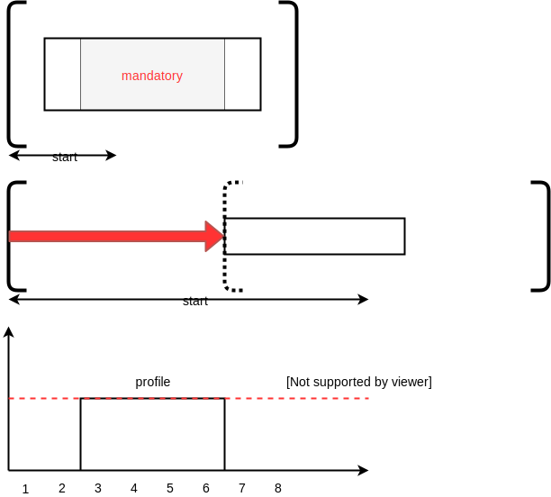

.. _minicp:

******************************
Exercises
******************************

We propose a set of exercises to extend mini-cp with useful features.
By doing these exercises you will gradually progress in your understanding of CP.
For each exercise, we ask you to implement JUnit tests to make sure that
your implementation works as expected.
If you don't test each feature independently you take the risk to
loose a lot of time finding very difficult bugs.

*We ask you not to publish your solutions on a public repository.
The instructors interested to get the source-code of
the solutions can contact us.*

Learning Outcomes
=======================================

Be able to

* Understand reversible data structures
* Understand a domain
* Implement global constraints
* Implement custom search
* Model CP easy problems
* Use LNS
* Write unit-tests for constraints and models
* Debug constraints, models, etc

Theoretical Exercises
=================================

Some theoretical `quizz <https://inginious.org/course/minicp/>`_

Less or equal reified constraint
=================================

Implement `IsLessOrEqual.java <https://bitbucket.org/minicp/minicp/src/HEAD/src/main/java/minicp/engine/constraints/IsLessOrEqual.java?at=master>`_

This is a reified constraint for `b iff x <= v`
that is boolean variable `b` is set true if and only if `x` variable is less or equal to value `v`.

For example the constraint holds for

.. code-block:: java

    b = true , x = 4, v = 5
    b = false, x = 4, v = 2

but is violated for

.. code-block:: java

    b = true , x = 5, v = 4
    b = false, x = 2, v = 4

Check that your implementation passes the tests `IsLessOrEqualTest.java <https://bitbucket.org/minicp/minicp/src/HEAD/src/test/java/minicp/engine/constraints/IsEqualTest.java?at=master>`_

DFS Explicit Stack
===================

The search algorithm of mini-cp is *depth-first-search*.
It is implemented using a recursive method in the class
`DFSSearch.java <https://bitbucket.org/minicp/minicp/src/HEAD/src/main/java/minicp/search/DFSearch.java?at=master>`_.
To avoid any `stack-overflow` exception due to too a deep recursion in Java
we ask you to reimplement the depth-first-search with an explicit stack
of instead of relying on the recursion call stack.

Consider the following search tree where alternatives to execute are represented as letters. 

.. image:: _static/dfs.svg
    :scale: 50
    :width: 250
    :alt: DFS

A DFS exploration should executes the alternative in the following order `A->D->E->B->C->F->G`.
On backtrack, the state should be restored and therefore these successive executions of the alternatives
should be interleaved with 'push' and 'pop' operations on the trail.
For instance a valid sequence for restoring the states on backtrack is the following:
`push->A->push->D->pop->push->E->pop->pop->push->B->pop->push->C->push->F->pop->push->G->pop->pop`.
The `push` operations are executed in pre-order fashion while the `pop` operations are executed in a post-order fashion.
This is highlighted in the recursive dfs code given next.

.. code-block:: java
   :emphasize-lines: 10, 13, 19

    private void dfs(SearchStatistics statistics, SearchLimit limit) {
        if (limit.stopSearch(statistics)) throw new StopSearchException();
        Alternative [] alternatives = choice.call(); // generate the alternatives
        if (alternatives.length == 0) {
            statistics.nSolutions++;
            notifySolutionFound();
        }
        else {
            for (Alternative alt : alternatives) {
                state.push(); // pre-order
                try {
                    statistics.nNodes++;
                    alt.call(); // call the alternative
                    dfs(statistics,limit);
                } catch (InconsistencyException e) {
                    notifyFailure();
                    statistics.nFailures++;
                }
                state.pop(); // post-order
            }
        }
    }

A skeletton of solution is given next but you don't have to follow exactly this solution since there are many ways
to implement it.

.. code-block:: java
   :emphasize-lines: 3

    private void dfs(SearchStatistics statistics, SearchLimit limit) {
        Stack<Alternative> alternatives = new Stack<Alternative>();
        expandNode(alternatives,statistics); // root expension
        while (!alternatives.isEmpty()) {
            if (limit.stopSearch(statistics)) throw new StopSearchException();
            try {
                alternatives.pop().call();
            } catch (InconsistencyException e) {
                notifyFailure();
                statistics.nFailures++;
            }
        }
    }
    private void expandNode(Stack<Alternative> alternatives, SearchStatistics statistics) {
       // TODO
    }

The idea of this solution is wrap the push/pop/alternative execution inside `Alternative` closure objects
as illustrated on the next figure showing the stack after the root node expansion at line 3. 

.. image:: _static/stackalternatives.svg
    :scale: 50
    :width: 250
    :alt: DFS
    
    
    
Check that your implementation passes the tests `DFSearchTest.java <https://bitbucket.org/minicp/minicp/src/HEAD/src/test/java/minicp/search/DFSearchTest.java?at=master>`_

Remark (optional): It is actually possible to reduce the number of operations on the trail 
by skipping the push on a last branch at a given node. 
The sequence of operations becomes `push->push->A->push->D->pop->E->pop->push->B->pop->C->push->F->pop->G->pop`.

Domain with an arbitrary set of values
=================================================================================

Implement the missing constructor in `IntVarImpl.java <https://bitbucket.org/minicp/minicp/src/HEAD/src/main/java/minicp/engine/core/IntVarImpl.java?at=master>`_

.. code-block:: java

    public IntVarImpl(Solver cp, Set<Integer> values) {
        throw new NotImplementedException();
    }

This exercise is straightforward: just create a dense domain then remove the values not present in the set.

Check that your implementation passes the tests `IntVarTest.java <https://bitbucket.org/minicp/minicp/src/HEAD/src/test/java/minicp/engine/core/IntVarTest.java?at=master>`_

Implement a domain iterator
======================================

Many filtering algorithms require to iterate over the values of a domain.
The `fillArray` method from `ReversibleSparseSet.java <https://bitbucket.org/minicp/minicp/src/HEAD/src/main/java/minicp/minicp/reversible/ReversibleSparseSet.java?at=master>`_
allows to fill an array with all the values present in the sparse-set relying on the very efficient 'System.arraycopy'.

.. code-block:: java

    /**
     * set the first values of <code>dest</code> to the ones
     * present in the set
     * @param dest, an array large enough dest.length >= getSize()
     * @return the size of the set
     */
    public int fillArray(int [] dest) {
        int s = size.getValue();
        System.arraycopy(values, 0, dest, 0, s);
        return s;
    }
    
    
The main advantage over the iterator mechanism is that not object is created (and thus garbage collected). 
Indeed `dest` is typically a container array stored as an instance variable and reused many times.
This is important for efficiency to avoid creating objects on the heap at each execution of a propagator.
Never forget that a 'propagate()' method of 'Constraint' may be called thousands of times per second.
This implementation using `fillArray` avoids the `ConcurrentModificationException` discussion 
when implementing an Iterator: should we allow to modify a domain while iterating on it ?
The answer here is very clear: you get a snapshot of the domain at the time of the call to `fillArray` and you can thus
safely iterate over this `dest` array and modifying the domain at the same time.

To do:

* Implement `public int fillArray(int [] dest)` in `IntVarImpl.java <https://bitbucket.org/minicp/minicp/src/HEAD/src/main/java/minicp/engine/core/IntVarImpl.java?at=master>`_.
* Check that your implementation passes the tests `IntVarTest.java <https://bitbucket.org/minicp/minicp/src/HEAD/src/test/java/minicp/engine/core/IntVarTest.java?at=master>`_ add also add more tests.

Implement a Custom Search
=================================

Modify the Quadratic Assignment Model `QAP.java <https://bitbucket.org/minicp/minicp/src/HEAD/src/main/java/minicp/examples/QAP.java?at=master>`_
to implement a custom search strategy. A skeleton for a custom search is the following one:

.. code-block:: java

        DFSearch dfs = makeDfs(cp,
                selectMin(x,
                        x -> x.getSize() > 1, // filter
                        x -> x.getSize(), // variable selector
                        xi -> {
                            int v = xi.getMin(); // value selector (TODO)
                            return branch(() -> equal(xi,v),
                                    () -> notEqual(xi,v));
                        }
                ));
                

* As a variable heuristic, select the unbound variable `x[i]` (a facility `i` not yet assigned to a location) that has a maximum weight `w[i][j]` with another facility `j` (`x[j]` may be bound or not).
* As a value heuristic, on the left branch, place this facility to on the location which is the closest possible to another location possible for facility `j`. On the right branch remove this value. 
* Hint: `selectMin` is a generic method parameterized by 'T'. To implement this heuristic, adding pairs `(i,j)` as a type for `T` is probably the easiest way to go.

   .. code-block:: java

           public static <T> Choice selectMin(T[] x, Filter<T> p, ValueFun<T> f, BranchOn<T> body)             

Experiment and modify LNS
=================================================================

Experiment the Quadratic Assignment Model with LNS `QAPLNS.java <https://bitbucket.org/minicp/minicp/src/HEAD/src/main/java/minicp/examples/QAPLNS.java?at=master>`_

* Does it converge faster to good solutions than the standard DFS ? Use the larger instance with 25 facilities.
* What is the impact of the percentage of variables relaxed (experiment with 5, 10 and 20%) ?
* What is the impact of the failure limit (experiment with 50, 100 and 1000)?
* Which parameter setting work best? How would you choose it?
* Imagine a different relaxation specific for this problem. Try to relax the decision variables that have the strongest impact on the objective (the relaxed variables should still be somehow randomized). You can for instance compute for each facility $i$: $sum_j d[x[i]][x[j]]*w[i][j]$ and base your decision to relax or not a facilities on those values. 

    
Element constraint
=================================

Implement `Element1D.java <https://bitbucket.org/minicp/minicp/src/HEAD/src/main/java/minicp/engine/constraints/Element1D.java?at=master>`_

An element constraint is to index an array `T` by an index variable `x` and link the result with a variable `z`.
More exactly the relation `T[x]=z` must hold.

Assuming `T=[1,3,5,7,3]`, the constraint holds for

.. code-block:: java

    x = 1, z = 3
    x = 3, z = 7

but is violated for

.. code-block:: java

    x = 0, z = 2
    x = 3, z = 3

Check that your implementation passes the tests `Element1DTest.java <https://bitbucket.org/minicp/minicp/src/HEAD/src/test/java/minicp/engine/constraints/Element1DTest.java?at=master>`_

Two possibilities:

1. extends `Element2D` and reformulate `Element1D` as an `Element2D` constraint in super call of the constructor.
2. implement a dedicated algo (propagate, etc) for `Element1D` by taking inspiration from `Element2D`.

Does your filtering achieve domain-consistency on D(Z)? Implement a domain-consistent version, write tests to make sure it is domain consistent.

Circuit Constraint
========================

The circuit constraint enforces an hamiltonian circuit on a successor array.
On the next example the successor array is `[2,4,1,5,3,0]`

.. image:: _static/circuit.svg
    :scale: 50
    :width: 250
    :alt: Circuit

All the successors must be different.
but enforcing the `allDifferent` constraint is not enough.
We must also guarantee it forms a proper circuit (without sub-tours).
This can be done efficiently and incrementally by keeping track of the sub-chains
appearing during the search.
The data-structure for the sub-chains should be a reversible.
Our instance variables used to keep track of the sub-chains are:

.. code-block:: java

    IntVar [] x;
    ReversibleInt [] dest;
    ReversibleInt [] orig;
    ReversibleInt [] lengthToDest;

* `dest[i]` is the furthest node we can reach from node `i` following the instantiated edges.
* `orig[i]` is the furthest node we can reach from node `i` following instantiated edges in reverse direction.
* `lengthToDest[i]` is the number of instantiated edges on the path from node `i` to `dest[i]`.

Consider the following example with instantiated edges colored in grey.

.. image:: _static/circuit-subtour.svg
    :scale: 50
    :width: 250
    :alt: Circuit

Before the addition of the green link we have

.. code-block:: java

    dest = [2,1,2,5,5,5];
    orig = [0,1,0,4,4,4];
    lengthToDest = [1,0,0,1,2,0];

After the addition of the green link we have

.. code-block:: java

    dest = [2,1,2,2,2,2];
    orig = [4,1,4,4,4,4];
    lengthToDest = [1,0,0,3,4,2];

In your implementation you must update the reversible integers to reflect
the change after the addition of every new edge.
You can use the `CPIntVar.whenBind(...)` method for that.

The filtering in itself consists in preventing to close a
sub-tour that would have a length less than `n` (the number of nodes).
Since node 4 has a length to destination (node 2) of 4 (<6), the destination node 2 can not have 4 as successor
and the red link is deleted.
This filtering was introduced in [TSP1998]_ for solving the TSP with CP.

Implement `Circuit.java <https://bitbucket.org/minicp/minicp/src/HEAD/src/main/java/minicp/engine/constraints/Circuit.java?at=master>`_.

Check that your implementation passes the tests `CircuitTest.java <https://bitbucket.org/minicp/minicp/src/HEAD/src/test/java/minicp/engine/constraints/CircuitTest.java?at=master>`_.

.. [TSP1998] Pesant, G., Gendreau, M., Potvin, J. Y., & Rousseau, J. M. (1998). An exact constraint logic programming algorithm for the traveling salesman problem with time windows. Transportation Science, 32(1), 12-29.

Custom search strategy
=================================

Modify `TSP.java <https://bitbucket.org/minicp/minicp/src/HEAD/src/main/java/minicp/examples/TSP.java?at=master>`_
to implement a custom search strategy.
A skeleton is the following one:

.. code-block:: java

        DFSearch dfs = makeDfs(cp,
                selectMin(succ,
                        succi -> succi.getSize() > 1, // filter
                        succi -> succi.getSize(), // variable selector
                        succi -> {
                            int v = succi.getMin(); // value selector (TODO)
                            return branch(() -> equal(succi,v),
                                    () -> notEqual(succi,v));
                        }
                ));

* The unbound variable selected is one with smallest domain (first-fail).
* It is then assigned the minimum value in the domain.

This value selection strategy is not well suited for the TSP (and VRP).
The one you design should be more similar to the decision you would
make manually in a greedy fashion.
For instance you can select as a successor for `succi`
the closest city in the domain.

Hint: Since there is no iterator on the domain of a variable, you can
iterate from the minimum value to the maximum one using a for loop
and check if it is in the domain with the `contains` method.

You can also implement a min-regret variable selection strategy.
It selects the variable with the largest different between the closest
successor city and the second closest one.
The idea is that it is critical to decide the successor for this city first
because otherwise you will regret it the most.

Observe the first solution obtained and its objective value ?
Is it better than the naive first fail ?
Also observe the time and number of backtracks necessary for proving optimality.
By how much did you reduce the computation time ?

LNS
=================================================================

Modify further `TSP.java <https://bitbucket.org/minicp/minicp/src/HEAD/src/main/java/minicp/examples/TSP.java?at=master>`_
to implement a LNS search.
Use the larger 17x17 distance matrix for this exercise.

What you should do:

* Record the assignment of the current best solution. Hint: use the `onSolution` call-back on the `DFSearch` object.
* Implement a restart strategy fixing randomly '10%' of the variables to their value in the current best solution.
* Each restart has a failure limit of 100 backtracks.

An example of LNS search is given in  `QAPLNS.java <https://bitbucket.org/minicp/minicp/src/HEAD/src/main/java/minicp/examples/QAPLNS.java?at=master>`_.
You can simply copy/paste/modify this implementation for the TSP.

Does it converge faster to good solutions than the standard DFS ?
What is the impact of the percentage of variables relaxed (experiment with 5, 10 and 20%) ?
What is the impact of the failure limit (experiment with 50, 100 and 1000)?
Which parameter setting work best? How would you choose it?

Table Constraint
================

The table constraint (also called extension constraint)
specify the list of solutions (tuples) assignable to a vector of variables.

More precisely, given an array `X` containing `n` variables, and an array `T` of size `m*n`, this constraint holds:

.. math::

    \exists i: \forall\ j\ T_{i,j} = X_j

That is, each line of the table is a valid assignment to `X`.

Here is an example of a table, with five tuples and four variables:

+-------------+------+------+------+------+
| Tuple index | X[0] | X[1] | X[2] | X[3] |
+=============+======+======+======+======+
|           1 |    0 |    1 |    2 |    3 |
+-------------+------+------+------+------+
|           2 |    0 |    0 |    3 |    2 |
+-------------+------+------+------+------+
|           3 |    2 |    1 |    0 |    3 |
+-------------+------+------+------+------+
|           4 |    3 |    2 |    1 |    2 |
+-------------+------+------+------+------+
|           5 |    3 |    0 |    1 |    1 |
+-------------+------+------+------+------+

In this particular example, the assignment `X={2, 1, 0, 3}` is then valid, but not `X={4, 3, 3, 3}` as there are no
such line in the table.

Many algorithms exists to filter table constraints.

One of the fastest filtering algorithm nowadays is Compact Table (CT) [CT2016]_.
In this exercise you'll implement a simple version of CT.

CT works in two steps:

1. Compute the list of supported tuples. A tuple `T[i]` is supported if, *for each* element `j` of the tuple,
  the domain of the variable `X[j]` contains the value `T[i][j]`.
2. Filter the domains. For each variable `x[j]` and value `v` in its
  domain, the value `v` can be removed if it's not used by any supported tuple.

Your task is to terminate the implementation in
`TableCT.java <https://bitbucket.org/minicp/minicp/src/HEAD/src/main/java/minicp/engine/constraints/TableCT.java?at=master>`_.

`TableCT` maintains for each pair
variable/value the set of tuples the pair maintains as an array of bitsets:

.. code-block:: java

    private BitSet[][] supports;

where `supports[j][v]` is
the (bit)set of supported tuples for the assignment `x[j]=v`.

Example
-------

As an example, consider that variable `x[0]` has domain `{0, 1, 3}`. Here are some values for `supports`:
`supports[0][0] = {1, 2}`
`supports[0][1] = {}`
`supports[0][3] = {4,5}`

We can infer two things from this example: first, value `1` does not support any tuples, so it can be removed safely
from the domain of `x[0]`. Moreover, the tuples supported by `x[0]` is the union of the tuples supported by its values;
we immediately see that tuple `3` is not supported by `x[0]` and can be discarded from further calculations.

If we push the example further, and we say that variable `x[2]` has domain `{0, 1}`, we immediately see that tuples `1`
and `2` are not supported by variable `x[2]`, and, as such, can be discarded. From this, we can infer that the value
`0` can be removed from variable `x[0]` as they don't support any tuple anymore.

Using bit sets
--------------

You may have assumed that the type of `supports` would have been `List<Integer>[][] supportedByVarVal`.
This is not the solution used by CT.

CT uses the concept of bit sets. A bit set is an array-like data structure that stores bits. Each bit is accessible by
its index. A bitset is in fact composed of an array of `Long`, that we call in this context a *word*.
Each of these words store 64 bits from the bitset.

Using this structures is convenient for our goal:

* Each supported tuple is encoded as a `1` in the bitset. `0` encodes unsupported tuples. In the traditional list/array
  representation, each supported tuple would have taken 32 bits to be represented.
* Doing intersection and union of bit sets (and these are the main operation that will be made on `supportedByVarVal`)
  is very easy, thanks to the usage of bitwise operators included in all modern CPUs.

Java provides a default implementation of bit sets in the class BitSet, that we will use in this exercise.
We encourage you to read its documentation before going on.

A basic implementation
----------------------

You will implement a version of CT that makes no use of the reversible structure (therefore it is probably much less efficient that the real CT algo).

You have to implement the `propagate()` method of the class `TableCT`. All class variables have already been initialized
for you.

You "simply" have to compute, for each call to `propagate()`:

* The tuples supported by each variable, which are the union of the tuples supported by the value in the domain of the
  variable
* The intersection of the tuples supported by each variable is the set of globally supported tuples
* You can now intersect the set of globally supported tuples with each variable/value pair in `supports`.
  If the value supports no tuple (i.e. the intersection is empty) then it can be removed.

Make sure you pass all the tests `TableTest.java <https://bitbucket.org/minicp/minicp/src/HEAD/src/test/java/minicp/engine/constraints/TableTest.java?at=master>`_.

.. [CT2016] Demeulenaere, J., Hartert, R., Lecoutre, C., Perez, G., Perron, L., Régin, J. C., & Schaus, P. (2016, September). Compact-table: Efficiently filtering table constraints with reversible sparse bit-sets. In International Conference on Principles and Practice of Constraint Programming (pp. 207-223). Springer.

Sequencer Combinator
======================

Sometimes we wish to branch on a given order on two families of variables, say `x[]` and then `y[]` as show on the next picture.
A variable in `y` should not be branched on before all the variables in `x` have been decided.
Furthermore, we may want to apply a specific heuristic on `x` which is different from the heuristic we want to apply on `y` variables.

.. image:: _static/combinator.svg
    :scale: 50
    :width: 200
    :alt: combinator

This can be achieved as follows

.. code-block:: java

    IntVar [] x;
    IntVar [] y;
    makeDfs(and(firstFail(x),firstFail(y)))

The `and` factory method creates a  `Sequencer.java <https://bitbucket.org/minicp/minicp/src/HEAD/src/main/java/minicp/search/Sequencer.java?at=master>`_.
You must complete its implementation.

Eternity Problem
======================

Fill in all the gaps in order to solve the Eternity II problem.

Your task is to terminate the implementation in
`Eternity.java <https://bitbucket.org/minicp/minicp/src/HEAD/src/main/java/minicp/examples/Eternity.java?at=master>`_.

* Create the table 
* Model the problem using table constraints
* Search for a feasible solution using branching combinators

Element constraint with array of variables
==================================================

Implement `Element1DVar.java <https://bitbucket.org/minicp/minicp/src/HEAD/src/main/java/minicp/engine/constraints/Element1DVar.java?at=master>`_

We have already seen the element constraint to index an array of integers `T` by an index variable `x` and link the result with a variable `z`: `T[x]=z`.
This time the constraint more general since `T` is an array of variables. 

We ask you to imagine and implement the filtering algorithm for `Element1DVar` constraint.
This filtering algorithm is not trivial, at least if you want to do it efficiently.
Two directions of implementation are

1. The domain consistent version
2. The hybrid domain-bound consistent one, assuming the domain of `z` is a full range but not the domain of `x` in which you can create holes (you can start with this one, easier than the full domain consistent one).

Check that your implementation passes the tests `Element1DVarTest.java <https://bitbucket.org/minicp/minicp/src/HEAD/src/test/java/minicp/engine/constraints/Element1DVarTest.java?at=master>`_
Those tests are not checking that the filtering is domain-consistent. Write additional tests to check the domain consistency.

The stable mariage problem
===========================

Complete the partial model `StableMariage.java <https://bitbucket.org/minicp/minicp/src/HEAD/src/main/java/minicp/examples/StableMariage.java?at=master>`_
This model makes use of the `Element1DVar` constraint you have just implemented and is also a good example of manipulation of logical and reified constraints.
Check that you discover the 6 solutions.

The absolute value constraint
==============================

Implement `Absolute.java <https://bitbucket.org/minicp/minicp/src/HEAD/src/main/java/minicp/engine/constraints/Absolute.java?at=master>`_

Again you will realize that several directions of implementation are possible

1. The full domain consistent version
2. An hybrid domain-bound consistent one

Check that your implementation passes the tests `AbsoluteTest.java <https://bitbucket.org/minicp/minicp/src/HEAD/src/test/java/minicp/engine/constraints/AbsoluteTest.java?at=master>`_

The maximum constraint
==============================

Implement `Maximum.java <https://bitbucket.org/minicp/minicp/src/HEAD/src/main/java/minicp/engine/constraints/Maximum.java?at=master>`_

Implement a bound-consistent filtering algorithm

Check that your implementation passes the tests `MaximumTest.java <https://bitbucket.org/minicp/minicp/src/HEAD/src/test/java/minicp/engine/constraints/MaximumTest.java?at=master>`_

Compact table algorithm for table constraints with short tuples
==================================================================

Implement `ShortTableCT.java <https://bitbucket.org/minicp/minicp/src/HEAD/src/main/java/minicp/engine/constraints/ShortTableCT.java?at=master>`_

Of course you should get a strong inspiration from the 
`TableCT.java <https://bitbucket.org/minicp/minicp/src/HEAD/src/main/java/minicp/engine/constraints/TableCT.java?at=master>`_
implementation you did in a previous exercise.

Check that your implementation passes the tests `ShortTableTest.java <https://bitbucket.org/minicp/minicp/src/HEAD/src/test/java/minicp/engine/constraints/ShortTableTest.java?at=master>`_

Compact table algorithm for negative table constraints
==================================================================

Implement `NegTableCT.java <https://bitbucket.org/minicp/minicp/src/HEAD/src/main/java/minicp/engine/constraints/NegTableCT.java?at=master>`_

Of course you should get a strong inspiration from the 
`TableCT.java <https://bitbucket.org/minicp/minicp/src/HEAD/src/main/java/minicp/engine/constraints/TableCT.java?at=master>`_
implementation you did in a previous exercise.

Check that your implementation passes the tests `NegTableTest.java <https://bitbucket.org/minicp/minicp/src/HEAD/src/test/java/minicp/engine/constraints/NegTableTest.java?at=master>`_

Cumulative Constraint: Decomposition
====================================

The `Cumulative` constraint models a scheduling resource with fixed capacity.
It has the following signature:

.. code-block:: java

    public Cumulative(IntVar[] start, int[] duration, int[] demand, int capa)

where `capa` is the capacity of the resource and `start`, `duration`, and `demand` are arrays of the same size and represents
properties of activities:

* `start[i]` is the variable specifying the start time of activity `i`
* `duration[i]` is the duration of activity `i`
* `demand[i]` is the resource consumption or demand of activity `i`

The constraint ensures that the cumulative consumption of activities (also called consumption profile)
at any time is below a given capacity:

.. math:: \forall t: \sum_{i \mid t \in \left [start[i]..start[i]+duration[i]-1 \right ]} demand[i] \le capa

The next visual example depicts three activities and their corresponding
consumption profile. As it can be observed, the profile never exceeds
the capacity 4.

.. image:: _static/scheduling.svg
    :scale: 50
    :width: 400
    :alt: scheduling cumulative

It corresponds to the instantiation of the Cumulative constraint:

.. code-block:: java

    Cumulative(start = [ 1, 2, 3], duration = [8, 3, 3], demand = [1, 2, 2], capa = 4)

Implement `CumulativeDecomp.java <https://bitbucket.org/minicp/minicp/src/HEAD/src/main/java/minicp/engine/constraints/CumulativeDecomp.java?at=master>`_.
This is a decomposition or reformulation of the cumulative constraint
in terms of simple arithmetic and logical constraints as
used in the above equation to describe its semantic.

At any time `t` of the horizon a `BoolVar overlaps[i]`
tells whether activity `i` overlaps time `t` or not.
Then the overall consumption in `t` is obtained by:

.. math:: \sum_{i} overlaps[i]*demand[i] \le capa

First make sure you understand the following code, then
add the few lines in the `TODO` to make
sure `overlaps` has the intended meaning.

.. code-block:: java

    public void post() throws InconsistencyException {

        int min = Arrays.stream(start).map(s -> s.getMin()).min(Integer::compare).get();
        int max = Arrays.stream(end).map(e -> e.getMax()).max(Integer::compare).get();

        for (int t = min; t < max; t++) {

            BoolVar[] overlaps = new BoolVar[start.length];
            for (int i = 0; i < start.length; i++) {
                overlaps[i] = makeBoolVar(cp);

                // TODO
                // post the constraints to enforce
                // that overlaps[i] is true iff start[i] <= t && t < start[i] + duration[i]
                // hint: use IsLessOrEqual, introduce BoolVar, use views minus, plus, etc.
                //       logical constraints (such as logical and can be modeled with sum)

            }

            IntVar[] overlapHeights = makeIntVarArray(cp, start.length, i -> mul(overlaps[i], demand[i]));
            IntVar cumHeight = sum(overlapHeights);
            cumHeight.removeAbove(capa);

        }

Check that your implementation passes the tests `CumulativeDecompTest.java <https://bitbucket.org/minicp/minicp/src/HEAD/src/test/java/minicp/engine/constraints/CumulativeDecompTest.java?at=master>`_.

Cumulative Constraint: Time-Table filtering
==============================================

The Cumulative and Time-Table Filtering introduced in  [TT2015]_
is an efficient yet simple filtering for Cumulative.

It is a two stage algorithm:

1. Build an optimistic profile of the resource consumption and check it does not exceed the capacity.
2. Filter the earliest start of the activities such that they are not in conflict with the profile.

Consider on the next example the depicted activity that can be executed anywhere between
the two brackets.
It can not execute at its earliest start since this would
violate the capacity of the resource.
We thus need to push the activity up until we find a time
where it can execute over its entire duration
without being in conflict with the profile and the capacity.
The earliest time  is 7.

.. image:: _static/timetable2.svg
    :scale: 50
    :width: 600
    :alt: scheduling timetable1

**Profiles**

We provide a class `Profile.java <https://bitbucket.org/minicp/minicp/src/HEAD/src/main/java/minicp/engine/constraints/Profile.java?at=master>`_
that is able to build efficiently a resource profile given an array of rectangles in input.
A rectangle has three attributes: `start`, `end`, `height` as shown next:

.. image:: _static/rectangle.svg
    :scale: 50
    :width: 250
    :alt: rectangle

A profile is nothing else than a sequence of rectangles.
An example of profile is given next. It is built from three input rectangles provided to the constructor
of `Profile.java <https://bitbucket.org/minicp/minicp/src/HEAD/src/main/java/minicp/engine/constraints/Profile.java?at=master>`_.
The profile consists in 7 contiguous rectangles.
The first rectangle `R0` starts at `Integer.MIN_VALUE` with a height of zero
and the last rectangle `R6` ends in `Integer.MAX_VALUE` also with a height of zero.
These two `dummy` rectangles are convenient because they guarantee
the property that any time point falls on one rectangle of the profile.

.. image:: _static/profile.svg
    :scale: 50
    :width: 650
    :alt: profile

Make sure you understand how to build and manipulate
`Profile.java <https://bitbucket.org/minicp/minicp/src/HEAD/src/main/java/minicp/engine/constraints/Profile.java?at=master>`_.

Have a quick look at `ProfileTest.java <https://bitbucket.org/minicp/minicp/src/HEAD/src/test/java/minicp/engine/constraints/ProfileTest.java?at=master>`_
for some examples of profile construction.

**Filtering**

Implement `Cumulative.java <https://bitbucket.org/minicp/minicp/src/HEAD/src/main/java/minicp/engine/constraints/Cumulative.java?at=master>`_.
You have three TODO tasks:

1. Build the optimistic profile from the mandatory parts.
2. Check that the profile is not exceeding the capacity.
3. Filter the earliest start of activities.

*TODO 1* is to build the optimistic profile
from the mandatory parts of the activities.
As can be seen on the next visual example, a mandatory part of an activity
is a part that is always executed whatever will be the start time of the activity
on its current domain.
It is the rectangle starting at `start[i].getMax()` that ends in `start[i].getMin()+duration()`
with a height equal to the demand of the activity.
Be careful because not every activity has a mandatory part.

*TODO 2* is to check that the profile is not exceeding the capacity.
You can check that each rectangle of the profile is not exceeding the capacity
otherwise you throw an `InconsitencyException`.

*TODO 3* is to filter the earliest start of unbound activities by pushing each
activity (if needed) to the earliest slot when it can be executed without violating the capacity threshold.

.. code-block:: java

    for (int i = 0; i < start.length; i++) {
            if (!start[i].isBound()) {
                // j is the index of the profile rectangle overlapping t
                int j = profile.rectangleIndex(start[i].getMin());
                // TODO 3: push i to the right
                // hint:
                // You need to check that at every-point on the interval
                // [start[i].getMin() ... start[i].getMin()+duration[i]-1] there is enough space.
                // You may have to look-ahead on the next profile rectangle(s)
                // Be careful that the activity you are currently pushing may have contributed to the profile.

            }
        }

Check that your implementation passes the tests `CumulativeTest.java <https://bitbucket.org/minicp/minicp/src/HEAD/src/test/java/minicp/engine/constraints/CumulativeTest.java?at=master>`_.

.. [TT2015] Gay, S., Hartert, R., & Schaus, P. (2015, August). Simple and scalable time-table filtering for the cumulative constraint. In International Conference on Principles and Practice of Constraint Programming (pp. 149-157). Springer.

The Resource-Constrained Project Scheduling Problem (RCPSP)
================================================================

A set of activities must be executed on a set of resources.

Fill in all the gaps in order to solve the RCPSP problem.

Your task is to terminate the implementation in
`RCPSP.java <https://bitbucket.org/minicp/minicp/src/HEAD/src/main/java/minicp/examples/RCPSP.java?at=master>`_.

* Create the cumulative constraint
* Post the precedence constraint
* Add instructions to minimize the makespan
* Minimize the makespan

Several instance of increasing sizes are available with 30,60,90 and 120 activities.
In order to test your model, the instance ``j30_1_1.rcp`` should have a minimum makespan of 43.
Don't expect to prove optimality for large size instances but you should reach it easily for 30 activities.

The JobShop Problem and disjunctive resource
=======================================================

Your task is to make the disjunctive constraint more efficient than using the cumulative constraint with unary capacity.

* Implement the constraint `IsLessOrEqualVar.java <https://bitbucket.org/minicp/minicp/src/HEAD/src/main/java/minicp/engine/constraints/IsLessOrEqualVar.java?at=master>`_
  for the reification `b iff x <= y`.
  This one will be useful implementing the decomposition for the disjunctive constraint..
* Test your implementation in `IsLessOrEqualVarTest.java. <https://bitbucket.org/minicp/minicp/src/HEAD/src/test/java/minicp/engine/constraints/IsLessOrEqualVarTest.java?at=master>`_
* Implement the decompostion with reified constraint for the `Disjunctive.java. <https://bitbucket.org/minicp/minicp/src/HEAD/src/main/java/minicp/engine/constraints/Disjunctive.java?at=master>`_ `
* Test if (as expected) this decomposition prunes more than the formulation with the TimeTable filtering for the cumulative constraint.
  Observe on the `JobShop.java <https://bitbucket.org/minicp/minicp/src/HEAD/src/main/java/minicp/examples/JobShop.java?at=master>`_ problem if the number of backtracks is reduced with the decomposition instead of the formulation with the cumulative.
  Test for instance on the small instance `data/jobshop/sascha/jobshop-4-4-2` with 4 jobs, 4 machines, 16 activities.
* Read and make sure you understand the implementation  `ThetaTree.java. <https://bitbucket.org/minicp/minicp/src/HEAD/src/main/java/minicp/engine/constraints/ThetaTree.java?at=master>`_
  Some unit-tests are implemented in `ThetaTreeTest.java. <https://bitbucket.org/minicp/minicp/src/HEAD/src/test/java/minicp/engine/constraints/ThetaTreeTest.java?at=master>`_
  To make sure you understand it, add a unit-test with 4 activities and compare the results with a manual computation.
* The overlad-checker, detectable precedences, not-first, edge-finding only filter one side of the activities.
  To get the symmetrical filtering implement the mirroring activities trick similarly to `Cumulative.java <https://bitbucket.org/minicp/minicp/src/HEAD/src/main/java/minicp/engine/constraints/Cumulative.java?at=master>`_.
* Implement the overload-checker in `Disjunctive.java <https://bitbucket.org/minicp/minicp/src/HEAD/src/main/java/minicp/engine/constraints/Disjunctive.java?at=master>`_
* The overload-checker should already make a big difference to prune the search tree. Make sure that larger-job-shop instances are now accessible for instance the `data/jobshop/sascha/jobshop-6-6-0` should now become easy to solve.
* Implement the detectable-precedence in `Disjunctive.java <https://bitbucket.org/minicp/minicp/src/HEAD/src/main/java/minicp/engine/constraints/Disjunctive.java?at=master>`_
* Implement the not-first-not last in `Disjunctive.java <https://bitbucket.org/minicp/minicp/src/HEAD/src/main/java/minicp/engine/constraints/Disjunctive.java?at=master>`_
* Make sure you pass the tests `DisjunctiveTest.java <https://bitbucket.org/minicp/minicp/src/HEAD/src/test/java/minicp/engine/constraints/DisjunctiveTest.java?at=master>`_
* (optional for a bonus) Implement the edge-finding in `Disjunctive.java <https://bitbucket.org/minicp/minicp/src/HEAD/src/main/java/minicp/engine/constraints/Disjunctive.java?at=master>`_ (you will also need to implement the ThetaLambdaTree data-structure).

The logical or constraint and watched literals
=======================================================

* Implement the constraint `Or.java <https://bitbucket.org/minicp/minicp/src/HEAD/src/main/java/minicp/engine/constraints/Or.java?at=master>`_
  for modeling the logical clause constraint: `(x[0] or x[1] or x[2] ... x[n-1])`.
* Test your implementation in `OrTest.java. <https://bitbucket.org/minicp/minicp/src/HEAD/src/test/java/minicp/engine/constraints/OrTest.java?at=master>`_
* The implementation should use the watched literals technique.

A reminder about the watched literals technique:

*  The constraint should only listen to the changes of two unbound variables with `propagateOnBind(this)`
  and dynamically listen to other ones whenever of these two become bound. Keep in mind that
  any call to `x[i].propagateOnBind(this)` has a reversible effect on backtrack.
* Why two ? Because as long as there is one unbound one, the constraint is still satisfiable and nothing need to be propagated
  and whenever it is detected that only one is unbound and all the other ones are set to false,
  the last one must be set to true (this is called unit propagation in sat-solvers).
* The two unbound variables
  should be at indexes `wL` (watched left) and `wR` (watched right).
  As depicted below `wL` (`wR`) is the left (right) most unbound variable.
* Those indices are store in `ReversibleInt` such that they can only increase during search (incrementality).
* When `propagate` is called, it means that one of the two watched variable is bound (`x[wL] or x[wR]`) and
  consequently the two pointers must be updated.
* If during the update a variable bound to `true` is detected, the constraint can be deactivated since it will always be satisfied.

.. image:: _static/watched-literals.svg
    :scale: 50
    :width: 600
    :alt: watched literals

The logical reified or constraint
=======================================================

* Implement the constraint `IsOr.java <https://bitbucket.org/minicp/minicp/src/HEAD/src/main/java/minicp/engine/constraints/IsOr.java?at=master>`_
  for modeling the logical clause constraint: `b iff (x[0] or x[1] or x[2] ... x[n-1])`.
* Test your implementation in `IsOrTest.java. <https://bitbucket.org/minicp/minicp/src/HEAD/src/test/java/minicp/engine/constraints/IsOrTest.java?at=master>`_
* In case `b` is true, you can post your previous `Or` constraint
(create it once and forall and post it when needed to avoid creating objects during search that would trigger Garbage Collection).

Steel Mill Slab Problem: Modeling, redundant constraints and symmetry breaking
======================================================================================

A number of TODO must be completed in `Steel.java <https://bitbucket.org/minicp/minicp/src/HEAD/src/main/java/minicp/examples/Steel.java?at=master>`_
that will gradually improve the performance for solving this problem optimally.

1. Model the objective function computing the total loss to be minimized. You should use element constraints to compute the loss
   in each slab. The precomputed array `loss` gives for each load (index) the loss
   that would be induced. It is precomputed as the difference between the smallest capacity that can accommodate
   the load and the load value. A sum constraint constraint can then be used to compute the total loss.

2. Model a boolean variable reflecting the presence or not of each color in each slab.
   The color is present if at least one order with such color is present.
   The `IsOr` constraint previously implemented can be used for that.
3. Restrict the number of colors present in slab j to be <= 2.
   Your model can now be run, although it will not be able to solve optimally yet the easiest instance `data/steel/bench_20_0`.
4. Add a redundant constraint for the bin-packing stating that sum of the loads is equal to the sum of elements.
   Do you observe an improvement in the solving complexity ?
5. Add static symmetry breaking constraint. Two possibilities: the load of slabs must be decreasing or the losses must be decreasing.
   Do you observe an improvement in the solving complexity ?
6. Implement a dynamic symmetry breaking during search. Select an order `x` representing the slab where this order is placed.
   Assume that the maximum index of a slab containing an order is m.
   Then create m+1 branches with x=0,x=1,...,x=m,x=m+1 since all the decisions x=m+2,x=m+3 ... would subproblems symmetrical with x=m+1.
   You should now be able to solve optimally the instance 'data/steel/bench_20_0' reaching a zero loss solution.

GAC filtering for the AllDifferent Constraint
======================================================================================

The objective here is to implement the filtering algorithm described in  [REGIN94]_
to remove every impossible value for the `AllDifferent` constraint (Arc-Consistency).
More precisely you must:

* Implement the constraint `AllDifferentAC.java <https://bitbucket.org/minicp/minicp/src/HEAD/src/main/java/minicp/engine/constraints/AllDifferentAC.java?at=master>`_.
* Test your implementation in `AllDifferentACTest.java. <https://bitbucket.org/minicp/minicp/src/HEAD/src/test/java/minicp/engine/constraints/AllDifferentACTest.java?at=master>`_

Régin's algorithm proceeds in four steps described in the following figure.

.. image:: _static/alldifferent.png
    :scale: 70
    :alt: profile

1. It computes an initial maximum matching in the variable value graph for the consistency test.
2. It build an oriented graph. Matched edges from right to left, un matched edge from left to right. There is also one dummy node
   with in-comming edges from unmatched value nodes, and out-going edges toward matched value nodes.
3. It computes strongly connected components.
4. Any edge that is not in the initial maximum matching and connects two nodes from different components is removed.

The two main algorithmic building blocks are provided.

* `MaximumMatching.java <https://bitbucket.org/minicp/minicp/src/HEAD/src/main/java/minicp/engine/constraints/MaximumMatching.java?at=master>`_
  is a class that computes a maximum matching given an array of variables. Instantiate this class once and for all in the constructor
  then you should simply call `compute` in the `propagate` method.
* `GraphUtil.java <https://bitbucket.org/minicp/minicp/src/HEAD/src/main/java/minicp/util/GraphUtil.java?at=master>`_
  contains a static method with signature `public static int[] stronglyConnectedComponents(Graph graph)` to compute strongly connected
  components. The returned array gives from each node, the connected component id.

One of the main difficulty of this exercise is to implement the `Graph` interface
to represent the residual graph of the maximum matching.

.. code-block:: java

    public static interface Graph {
        /* the number of nodes in this graph */
        int n();

        /* incoming nodes ids incident to node idx */
        Iterable<Integer> in(int idx);

        /* outgoing nodes ids incident to node idx */
        Iterable<Integer> out(int idx);
    }

It uses an adjacency list that is updated in the method `updateGraph()`.
We advise you to use a dense representation with node ids as illustrated on the black nodes of the example (step2: directed graph).

Once your code passes the tests, you can experiment your new constraint on all the models you have seen so far
to measure the pruning gain on the number of nodes (NQueens, Eternity, TSP, QAP, etc).

.. [REGIN94] Régin, J.-C. (1994). A filtering algorithm for constraints of difference in CSPs, AAAI-94

Discrepancy Limited Search (optional)
=================================================================

Implement ``LimitedDiscrepancyBranching``, a branching that can wrap any branching
to limit the discrepancy of the branching.

Test your implementation in `LimitedDiscrepancyBranchingTest.java. <https://bitbucket.org/minicp/minicp/src/HEAD/src/test/java/minicp/search/LimitedDiscrepancyBranchingTest.java?at=master>`_

Conflict based search strategy
=================================================================

Last Conflict [LC2009]_
Conflict Ordering Search [COS2015]_

.. [LC2009] Lecoutre, C., Saïs, L., Tabary, S., & Vidal, V. (2009). Reasoning from last conflict (s) in constraint programming. Artificial Intelligence, 173(18), 1592-1614.

.. [COS2015] Gay, S., Hartert, R., Lecoutre, C., & Schaus, P. (2015). Conflict ordering search for scheduling problems. In International conference on principles and practice of constraint programming (pp. 140-148). Springer.

Restarts (optional)
========================

TODO

AllDifferent Forward Checking (optional)
=========================================

Implement a dedicated algorithm for the all-different.
Whenever a variable is bound to a value, this value is removed from the domain of other variables.

  
     

