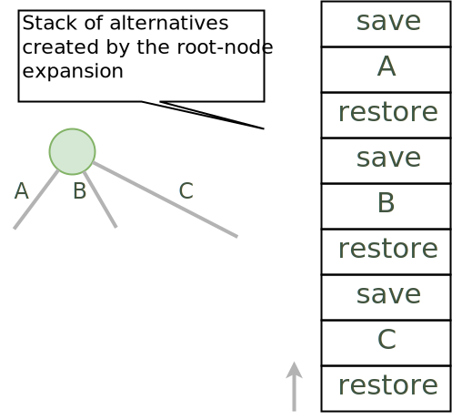

*****************************************************************
Part 3: Memory Management (Trail + Copy) and Search
*****************************************************************

*We ask you not to publish your solutions on a public repository.
The instructors interested to get the source code of
our solutions can contact us.*

Slides
======

`Lectures on Youtube <https://youtube.com/playlist?list=PLq6RpCDkJMypASwwjt0XfPW0j27guprFT>`_

`Memory Management: Copy and Trail, Search <https://www.icloud.com/keynote/0wmHrabdvZYKaDOBYv-wK09Wg#03-state-management-search>`_

Theoretical questions
=====================

* `State managers <https://inginious.org/course/minicp/statemanager>`_

DFS Explicit Stack
===================

The search algorithm of MiniCP is *depth-first-search*.
It is implemented using a recursive method in the class
`DFSearch.java <https://bitbucket.org/minicp/minicp/src/HEAD/src/main/java/minicp/search/DFSearch.java?at=master>`_.
To avoid any `stack-overflow` exception due to a too deep recursion in Java
we ask you to reimplement the depth-first search with an explicit stack
instead of relying on the recursion-call stack.

Consider the following search tree where alternatives to execute are represented as letters:

.. image:: ../_static/dfs.svg
    :scale: 50
    :width: 250
    :alt: DFS

A DFS exploration should execute the branches in the following order `A->D->E->B->C->F->G`.
On backtrack, the state should be restored and therefore these successive executions of the branches
should be interleaved with 'push' and 'pop' operations on the trail.
For instance, a valid sequence for restoring the states on backtrack is the following:
`push->A->push->D->pop->push->E->pop->pop->push->B->pop->push->C->push->F->pop->push->G->pop->pop`.
The `push` operations are executed in pre-order fashion while the `pop` operations are executed in a post-order fashion.
This is highlighted in the recursive dfs code given next:

.. code-block:: java
   :emphasize-lines: 10, 13, 19

        private void dfs(SearchStatistics statistics, Predicate<SearchStatistics> limit) {
            if (limit.stopSearch(statistics)) throw new StopSearchException();
            Procedure[] branches = branching.get();
            if (alternatives.length == 0) {
                statistics.nSolutions++;
                notifySolutionFound();
            }
            else {
                for (Procedure b : branches) {
                    state.saveState(); // pre-order
                    try {
                        statistics.nNodes++;
                        alt.call(); // call the alternative
                        dfs(statistics,limit);
                    } catch (InconsistencyException e) {
                        notifyFailure();
                        statistics.nFailures++;
                    }
                    state.restoreState(); // post-order
                }
            }
        }

A skeleton code for a solution is given next but you don't have to follow exactly this solution since there are many ways to implement it:

.. code-block:: java
   :emphasize-lines: 3

        private void dfs(SearchStatistics statistics, Predicate<SearchStatistics> limit) {
            Stack<Procedure> alternatives = new Stack<Procedure>();
            expandNode(alternatives,statistics); // root expension
            while (!alternatives.isEmpty()) {
                if (limit.stopSearch(statistics)) throw new StopSearchException();
                try {
                    alternatives.pop().call();
                } catch (InconsistencyException e) {
                    notifyFailure();
                    statistics.nFailures++;
                }
            }
        }
        private void expandNode(Stack<Procedure> alternatives, SearchStatistics statistics) {
           // TODO
        }

The idea of this solution is to wrap the push/pop/alternative execution inside `Alternative` closure objects
as illustrated in the next figure showing the stack after the root node expansion at line 3:

Check that your implementation passes the tests `DFSearchTest.java <https://bitbucket.org/minicp/minicp/src/HEAD/src/test/java/minicp/search/DFSearchTest.java?at=master>`_.

Remark (optional): It is actually possible to reduce the number of operations on the trail
by skipping the push on a last branch at a given node.
The sequence of operations becomes `push->push->A->push->D->pop->E->pop->push->B->pop->C->push->F->pop->G->pop`.

Implement a Custom Search
=================================

Modify the Quadratic Assignment model `QAP.java <https://bitbucket.org/minicp/minicp/src/HEAD/src/main/java/minicp/examples/QAP.java?at=master>`_
to implement a custom search strategy. A skeleton code for a custom search is the following one:

.. code-block:: java

        DFSearch dfs = makeDfs(cp, () -> {
            IntVar sel = selectMin(x,
                    vari -> vari.size() > 1, // filter
                    vari -> vari.size()      // variable selector
            );
            if (sel == null)
                return EMPTY;
            int v = sel.min(); // value selector (TODO)
            return branch(
                () -> equal(sel,v),
                () -> notEqual(sel,v)
            );
        });

* As a variable heuristic, select an unbound variable `x[i]` (a facility `i` not yet assigned to a location) that has a maximum weight `w[i][j]` with another facility `j` (where `x[j]` may be bound or not).
* As a value heuristic, on the left branch place this facility on a location :math:`k` which is the closest possible to another location possible for the facility `j` you selected earlier. On the right branch remove the value :math:`k`.
* Hint: `selectMin` is a generic method parameterized by 'T' and 'N' (the type on which the minimum is computed). To implement this heuristic, adding pairs `(i,j)` as a type for `T` is probably the easiest way to go:

.. code-block:: java

    public static <T, N extends Comparable<N>> T selectMin(T[] x, Predicate<T> p, Function<T, N> f)

Sequencer Combinator
======================

Sometimes we wish to branch in a given order on two families of variables, say `x[]` and then `y[]`, as shown in the next picture.
A variable in `y` should not be branched on before all the variables in `x` have been decided.
Furthermore, we may want to apply a specific heuristic on `x` which is different from the heuristic we want to apply on `y`:

.. image:: ../_static/combinator.svg
    :scale: 50
    :width: 200
    :alt: combinator

This can be achieved as follows:

.. code-block:: java

    IntVar [] x;
    IntVar [] y;
    makeDfs(and(firstFail(x),firstFail(y)))

The `and` factory method creates a  `Sequencer.java <https://bitbucket.org/minicp/minicp/src/HEAD/src/main/java/minicp/search/Sequencer.java?at=master>`_.
You must complete its implementation.

Check on INGInious
==================

When you are done implementing your constraints and branching functions, do not forget to upload
your code on INGInious to actually get your grade!
